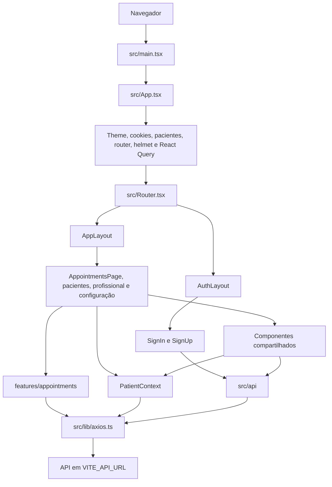

# Arquitetura do Sistema

## Controle do documento

| Campo                 | Valor                                                                                            |
| --------------------- | ------------------------------------------------------------------------------------------------ |
| Repositório analisado | `agendamentos-smart`                                                                             |
| Commit-base           | `62ac47e` (`feat: add getProfile`)                                                               |
| Data da análise       | 6 de agosto de 2026                                                                              |
| Escopo                | Aplicação web, configurações, dependências, dados simulados e grafo estático de imports/chamadas |
| Validações executadas | `npm run build` e `npx eslint src vite.config.ts`                                                |

Este documento descreve o que existe no código. **Hipótese** identifica uma conclusão de produto ou arquitetura que não está integralmente implementada.

As decisões-alvo posteriores estão em [Requisitos do MVP](Requisitos%20do%20MVP.md). Em especial, o frontend deverá evoluir para isolamento por `tenantId`, unidade padrão identificada por `unitId`, contratos canônicos e autorização por perfil, sem que isso seja confundido com o estado atual.

## Visão arquitetural

O sistema é uma aplicação de página única (SPA) executada no navegador. React compõe a interface, React Router seleciona páginas e layouts, e uma API externa configurada por `VITE_API_URL` fornece autenticação, perfil e pacientes. Não há backend da aplicação neste repositório; `data.json` pode ser servido por `json-server`, mas seus recursos não correspondem a todos os endpoints consumidos.



A organização legada é predominantemente por camadas técnicas (`page`,
`components`, `api`, `context`, `lib`). Agendamentos já seguem organização por
domínio em `features/appointments`, com contrato canônico, API, hooks,
componentes, página e testes no mesmo limite de feature.

## Inicialização e composição

1. `index.html` fornece o elemento `#root`.
2. `src/main.tsx` monta `App` sem `StrictMode` ativo.
3. `src/App.tsx` carrega os estilos globais e instala, nesta ordem, cookies, `PatientProvider`, `BrowserRouter`, metadados, notificações e `QueryClientProvider`.
4. `src/Router.tsx` declara a rota inicial, as páginas de autenticação e as páginas internas.
5. A rota `/` espera um segundo, verifica apenas a presença do cookie `jwt` e navega para login ou agenda.

### Rotas efetivas

| Rota             | Layout       | Componente         | Estado comprovado                                  |
| ---------------- | ------------ | ------------------ | -------------------------------------------------- |
| `/`              | nenhum       | `FirstScreen`      | Redirecionamento por presença do cookie `jwt`      |
| `/sign-in`       | `AuthLayout` | `SignIn`           | Login via `POST /auth/login`                       |
| `/sign-up`       | `AuthLayout` | `SignUp`           | Formulário visual; não registra usuário            |
| `/appointments`  | `AppLayout`  | `AppointmentsPage` | Agenda semanal integrada à API e criação manual    |
| `/paciente`      | `AppLayout`  | `Patient`          | Lista e duas implementações de criação de paciente |
| `/doctor`        | `AppLayout`  | `Doctor`           | Página mínima, sem fluxo funcional                 |
| `/configuration` | `AppLayout`  | `Configuration`    | Página vazia                                       |

Não existe rota curinga (`404`) nem guarda de rota no `AppLayout`.

## Mapa de módulos e responsabilidades

| Módulo                      | Responsabilidade atual                       | Dependências relevantes         | Consumidores                   |
| --------------------------- | -------------------------------------------- | ------------------------------- | ------------------------------ |
| `src/_layout`               | Estrutura visual pública e interna           | Router, Header, MenuMobile      | `Router.tsx`                   |
| `src/page/auth`             | Telas de entrada e cadastro visual           | API, React Query, forms, router | `Router.tsx`                   |
| `src/features/appointments` | Domínio, API, cache, criação e grade semanal | React Query, Zod, date-fns      | `Router.tsx`                   |
| `src/page/patient`          | Lista, filtro e criação de pacientes         | contexto, UI, forms             | `Router.tsx`                   |
| `src/page/doctor`           | Placeholder de profissional                  | React                           | `Router.tsx`                   |
| `src/page/Configuration`    | Placeholder de configuração                  | React                           | `Router.tsx`                   |
| `src/components`            | Navegação, modais, cartões e paginação       | UI, API, contexto               | layouts e páginas              |
| `src/components/ui`         | Primitivos visuais reutilizáveis             | Radix, Tailwind, CVA            | páginas e componentes          |
| `src/context`               | Estado e operações legadas de pacientes      | Axios, context selector         | pacientes                      |
| `src/api`                   | Chamadas HTTP e utilitários de token         | Axios e Web Storage             | autenticação, Header, paciente |
| `src/lib`                   | Axios, QueryClient e merge de classes        | env, Axios, React Query         | API, contexto e UI             |
| `src/globals.css`           | Tailwind e design tokens globais             | Tailwind                        | `App` e componentes visuais    |
| `src/assets`                | Imagens locais atualmente sem consumidores   | bundler Vite                    | nenhum import ativo            |

## Padrões de implementação observados

### Composição por providers

`App` centraliza providers transversais. O padrão facilita acesso global, mas
`PatientProvider` ainda envolve páginas de autenticação, embora elas não usem
seu estado.

### Layouts roteados

`AuthLayout` e `AppLayout` usam `Outlet` para compartilhar estrutura. O padrão é adequado à separação entre entrada e área interna; falta proteção de acesso no layout interno.

### Funções de API por operação

Arquivos legados em `src/api` exportam funções assíncronas por operação. A
feature `appointments` concentra suas operações em `api/appointments.ts`, com
entradas e respostas tipadas e mensagens de erro de domínio.

### Estado remoto misto

- React Query executa login, consultas e criação de agendamentos e o cadastro em `AddPatientModal`.
- `PatientContext` guarda a lista de pacientes e acessa Axios diretamente.
- A agenda mantém apenas a data de referência em estado local; os agendamentos
  remotos pertencem ao cache do React Query.

Essa coexistência não define uma fonte única para estado de servidor e provoca duplicação de responsabilidades.

### Formulários validados por schema

Login e cadastros de paciente combinam React Hook Form e Zod. O cadastro visual de usuário não usa esses mecanismos e não envia dados.

### Estratégia de estilo consolidada

- Tailwind CSS e variáveis semânticas em `globals.css`.
- Primitivos Radix/shadcn em `components/ui` e composição de variantes com CVA/`cn`.

`index.css` duplica boa parte de `globals.css`, mas não é importado. O provider de tema baseado em classes permanece disponível e desconectado.

## Separação de responsabilidades

### Fronteiras existentes

- páginas coordenam componentes e interações de tela;
- layouts fornecem estruturas compartilhadas;
- componentes de UI encapsulam primitivos visuais;
- `api` concentra parte das operações HTTP;
- `lib` cria dependências de infraestrutura;
- `env.ts` valida a configuração de runtime;
- contexto compartilha provisoriamente os pacientes do fluxo legado.

### Fronteiras violadas ou pouco definidas

- `src/api/firstScreen/first-screen.tsx` é um componente de roteamento dentro da camada de API;
- `PatientContext` mistura estado remoto, chamadas HTTP e criação de paciente;
- `CardDay` contém massa antiga de agendamentos fixa, mas não participa da rota
  `/appointments`;
- `AddPatientModal` executa API diretamente enquanto outro modal delega a criação ao contexto;
- tipos de paciente são redefinidos localmente e não representam um contrato único;
- componentes de navegação contêm textos de produto e caminhos diretamente.

Não foram identificados ciclos explícitos no grafo estático de imports, mas existem acoplamentos transversais frequentes entre páginas, componentes, contexto e API.

## Dependências críticas

| Dependência            | Uso real                           | Impacto arquitetural                                  |
| ---------------------- | ---------------------------------- | ----------------------------------------------------- |
| React / React DOM      | Renderização e estado              | Base de toda a SPA                                    |
| React Router           | Rotas, layouts e navegação         | Acesso e composição de telas dependem dele            |
| Axios                  | Cliente HTTP com `withCredentials` | Todas as integrações reais usam uma única `baseURL`   |
| TanStack React Query   | Perfil, catálogos e agendamentos   | Fonte do estado remoto da feature `appointments`      |
| React Hook Form + Zod  | Formulários e validação            | Contratos de entrada locais às telas                  |
| react-cookie           | Leitura do cookie `jwt`            | Decide somente o redirecionamento da raiz             |
| use-context-selector   | Contexto legado de pacientes       | Acopla consumidores ao contrato de `PatientContext`   |
| date-fns               | Semana útil e formatação           | Cálculos locais da página de agendamentos             |
| Tailwind + Radix + CVA | Design system                      | Sustenta `components/ui`, páginas e componentes       |
| Vite                   | Build e ambiente                   | Expõe apenas variáveis `VITE_*` e resolve o alias `@` |

Dependências declaradas sem import ativo identificado: `@headlessui/react`, `@heroicons/react`, `phosphor-react` (apenas comentário) e `scheduler`. `react-datepicker` fornece apenas um CSS importado; o seletor visível usa `react-day-picker`. Pacotes Redux aparecem instalados como extrínsecos em `node_modules`, mas não constam em `package.json` nem são usados pelo código.

Na qualidade estática, o projeto mantém `.eslintrc` legado e `eslint.config.mjs` simultaneamente. A execução atual do ESLint 9 usa a configuração flat, que habilita somente as recomendações JavaScript/TypeScript; os plugins instalados de React e ordenação de imports não são adicionados nessa configuração.

## Contratos externos observados

| Método e caminho          | Origem                        | Uso                                   |
| ------------------------- | ----------------------------- | ------------------------------------- |
| `POST /auth/login`        | `src/api/sign-in.ts`          | Autenticação                          |
| `GET auth/me`             | `src/api/get-profile.ts`      | Perfil e clínica no Header            |
| `POST /auth/register/:id` | `src/api/register-user.ts`    | Não conectado à interface             |
| `GET patient/list`        | `PatientContext`              | Lista de pacientes                    |
| `POST /patient/save`      | `src/api/register-patient.ts` | Cadastro pelo modal compartilhado     |
| `POST patients`           | `PatientContext`              | Cadastro pelo diálogo local da página |
| `GET /api/scheduling`     | `features/appointments/api`   | Consulta externa de agendamentos      |
| `POST /api/scheduling`    | `features/appointments/api`   | Criação externa de agendamento        |

## Regras arquiteturais

### Regras já impostas pelo projeto

- TypeScript usa modo `strict` e não emite JavaScript durante a checagem.
- Imports podem usar o alias `@/*` para `src/*`.
- `VITE_API_URL` é obrigatório e validado por Zod.
- Chamadas HTTP reais devem reutilizar `src/lib/axios.ts` para respeitar `baseURL` e cookies.
- Tokens globais devem ser declarados em `src/globals.css` e consumidos por classes semânticas.

### Regras oficiais para novas implementações

Estas regras orientam código futuro; módulos legados listados neste documento ainda não obedecem a todas elas.

1. Uma funcionalidade deve ter uma única fonte para estado remoto. Prefira React Query para requisições e cache; use contexto apenas para estado realmente compartilhado que não seja derivável do servidor.
2. Operações HTTP devem ficar em módulos de API por domínio, com tipos de entrada e saída explícitos. Páginas e componentes visuais não devem importar Axios diretamente.
3. Rotas internas devem depender de uma guarda de autenticação central, nunca apenas do redirecionamento em `/`.
4. Componentes de `components/ui` não devem conhecer regras de negócio. Componentes específicos de uma funcionalidade devem permanecer junto da respectiva página/feature ou ser promovidos a compartilhados somente quando houver reuso real.
5. Não introduzir outro mecanismo de estilo. Novos componentes devem usar Tailwind e priorizar os primitivos Radix/shadcn existentes.
6. Não duplicar entidades. `Patient`, `Appointment`, perfil e respostas paginadas devem possuir contratos canônicos compartilhados.
7. Toda nova rota deve declarar estado de carregamento, erro, vazio, autorização e fallback de navegação quando aplicável.
8. Valores sensíveis, tokens, usuários e respostas de perfil não podem ser enviados a `console`.
9. Dados simulados devem ser isolados como fixtures e nunca embutidos em componentes de produção.
10. Uma mudança estrutural deve atualizar o README do módulo e os documentos transversais afetados.

## Convenções técnicas

### Convenções observadas

- componentes React em PascalCase, com exportações nomeadas na maioria dos casos;
- páginas legadas em `src/page` e novas telas de domínio dentro de `features`;
- estilos com classes Tailwind próximos da marcação e tokens globais em `globals.css`;
- primitivas shadcn/Radix em nomes de arquivo minúsculos;
- schemas Zod próximos ao formulário;
- notificações por `sonner`;
- formatação e textos em português brasileiro.

### Inconsistências a não reproduzir

- pastas legadas ainda alternam PascalCase e minúsculas (`Configuration`, `patient`, `doctor`);
- operações alternam PascalCase e camelCase (`RegisterPatient` versus `registerUser`);
- imports alternam alias `@` e caminhos relativos longos;
- há um arquivo com espaço inicial: `src/components/theme/ mode-toggle.tsx`;
- caminhos da API alternam barra inicial, singular e plural;
- o link do Header usa `to="/paciente  "`, com espaços finais, e não corresponde à rota declarada;
- componentes antigos ainda possuem nomes fora do contrato canônico, como `isToDay`.

Para código novo: usar nomes de pasta em kebab-case ou minúsculas de forma uniforme, componentes em PascalCase, funções em camelCase, alias `@` entre módulos e imports relativos apenas dentro da mesma pasta.

## Riscos técnicos e acoplamentos importantes

| Prioridade | Risco comprovado                          | Evidência e impacto                                                                                                         |
| ---------- | ----------------------------------------- | --------------------------------------------------------------------------------------------------------------------------- |
| Crítica    | Rotas internas sem proteção               | `/appointments`, `/paciente`, `/doctor` e `/configuration` podem ser abertas diretamente; `FirstScreen` protege somente `/` |
| Alta       | Exposição de informações no console       | Login registra token e usuário; perfil e pacientes também são registrados; o tipo de perfil inclui `password`               |
| Alta       | Criação de paciente duplicada             | Dois diálogos coexistem, usam `/patient/save` e `patients`, e atualizam estados diferentes                                  |
| Alta       | Contrato legado de paciente incorreto     | `PatientContext` importa `uuid` de Zod e envia a própria função no objeto; JSON não produz um identificador UUID            |
| Alta       | Cadastro de usuário apenas visual         | `SignUp` navega para a agenda sem chamar `registerUser` ou enviar os campos                                                 |
| Média      | Navegação quebrada para pacientes         | O Header aponta para `/paciente  ` em vez de `/paciente`                                                                    |
| Média      | Logout sem comportamento                  | O item “Sair” não possui callback nem remoção de cookie/token                                                               |
| Média      | Contexto com responsabilidades excessivas | Pacientes, HTTP e mutação compartilham o mesmo provider global                                                              |
| Média      | Contratos de backend divergentes          | Endpoints e formatos do mock não são equivalentes; `fetchPatients` exige `response.data.content`                            |
| Média      | Rotas incompletas                         | Profissional é um título; configuração é vazia; não existe 404                                                              |
| Média      | Bundle inicial grande                     | Build gera cerca de 800,71 kB minificados e alerta acima de 500 kB; não há lazy loading de rotas                            |
| Média      | Lint dependente do estado de `dist`       | `eslint .` inclui o bundle quando `dist/` existe e produz milhares de falsos erros no código gerado                         |
| Média      | Configuração de lint divergente           | `.eslintrc` e flat config coexistem; regras React e simple-import-sort instaladas não estão ativas no lint atual            |
| Baixa      | Assets e módulos órfãos                   | Aumentam ruído, dependências e custo de manutenção                                                                          |

## Módulos órfãos ou desconectados

“Órfão” significa sem consumidor ativo encontrado no grafo de imports/rotas; comentários não contam como uso.

| Caminho                                                                      | Situação                                                    |
| ---------------------------------------------------------------------------- | ----------------------------------------------------------- |
| `src/api/auth.ts`, `storageProxy.ts` e `constants/authorizationConstants.ts` | Cadeia de token em `localStorage` sem consumidor ativo      |
| `src/api/register-user.ts`                                                   | Não chamado pelo `SignUp`                                   |
| `src/context/useGlobalContext.tsx`                                           | Implementação comentada; exports não retornam estado útil   |
| `src/hooks/useRequest.ts`                                                    | Arquivo integralmente comentado                             |
| `src/@types/UserTypes.ts`                                                    | Referenciado somente pelo hook comentado                    |
| `src/components/nav-link.tsx`                                                | Não importado; Header usa o `NavLink` do Router diretamente |
| `src/components/theme`                                                       | Provider e seletor de tema não montados                     |
| `src/components/ui/pagination.tsx`                                           | Não usado; existe outra paginação compartilhada             |
| `src/components/ui/select.tsx`                                               | Sem consumidor ativo                                        |
| `src/index.css`                                                              | Não importado pela entrada da aplicação                     |
| `src/utils/formatter.ts`                                                     | Formatadores sem consumidor                                 |
| `src/assets/*.png` e `public/vite.svg`                                       | Nenhum import ou referência ativa identificada              |

`Doctor` e `Configuration` estão conectados a rotas, portanto não são órfãos, embora sejam placeholders.

## Diretrizes para evolução

### Ordem recomendada de estabilização

1. Definir o contrato real de autenticação por cookie, implementar guarda de rota e logout, e remover logs sensíveis.
2. Escolher uma única API de pacientes e uma única implementação de formulário; modelar paginação e invalidar/refazer a consulta após mutação.
3. Expandir a feature `appointments` mantendo API, cache, regras e telas no
   mesmo limite de domínio.
4. Conectar ou remover o cadastro de usuário, profissional e configuração conforme escopo de produto confirmado.
5. Padronizar estado remoto em React Query e separar cálculos puros de calendário do contexto.
6. Corrigir navegação, rota 404, estados de erro/carregamento/vazio e acessibilidade dos fluxos.
7. Introduzir testes de contratos de API, regras de data, componentes críticos e proteção de rotas.
8. Consolidar o ESLint em uma configuração única, excluir `dist` explicitamente e ativar regras React/Hooks compatíveis.
9. Aplicar lazy loading por rota e medir novamente o bundle.
10. Remover código, pacotes, estilos e assets órfãos após confirmação funcional.

### Estrutura-alvo incremental

**Hipótese:** caso o sistema cresça, uma organização por funcionalidade reduzirá os acoplamentos atuais. A migração pode ser gradual:

```text
src/
  app/                 # bootstrap, providers e rotas
  features/
    auth/              # API, modelos, páginas e componentes de autenticação
    patients/          # API, queries, modelos e telas de pacientes
    appointments/      # API, modelos, regras de calendário e telas
  shared/
    api/               # cliente HTTP e tratamento comum de erros
    ui/                # componentes sem regra de negócio
    lib/               # utilitários puros
```

Essa estrutura é uma diretriz, não a descrição do estado atual.

## Atualização e validação da documentação

Antes de publicar uma atualização:

- conferir `Router.tsx`, `App.tsx`, `package.json`, `env.ts`, `data.json` e todos os `api.get/post/...`;
- procurar consumidores de arquivos antes de classificá-los como órfãos;
- manter caminhos e contratos externos exatos;
- marcar intenção não implementada como **Hipótese**;
- executar build e lint apenas do código-fonte;
- registrar a nova data e o commit-base neste documento.
